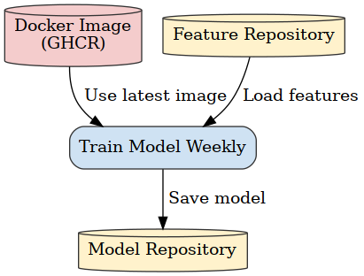

# Air Quality Prediction - Poprad, Slovakia

An air quality prediction system designed to forecast AQI (Air Quality Index) for Poprad, Slovakia using historical air‑quality and meteorological data. The system ingests historical air-pollution and weather data, trains ML models (e.g. XGBoost and LSTM), and serves a predictive model (with a live demo on Hugging Face Spaces). The workflow is fully automated using GitHub Actions: data collection, model training, and deployment all run as scheduled or on-demand workflows.

## 🌍 Demo

🔗 **Live Demo**: [Poprad AQI Prediction on Hugging Face](https://huggingface.co/spaces/martin-rajniak/poprad_aqi_prediction)

## 📋 Table of Contents
- [Key Features](#-key-features)
- [Methodology](#-methodology)
- [Results and Insights](#-results-and-insights)
- [Automation Pipeline](#-automation-pipeline)
- [Getting Started](#-getting-started)

## 🌟 Key Features
- **Time Series Recursive Forecasting:** Utilizes an XGBoost model for accurate forecasting.
- **Containerized:** Fully containerized with Docker for easy setup and consistent environments.
- **Automated Pipeline:** CI/CD pipeline with GitHub Actions for automated testing and building.
- **Data-Driven:** Uses historical data to train the prediction model.

## 🔬 Methodology

### About Poprad

Poprad is located in northern Slovakia, near the High Tatras mountains. The city's air quality is influenced by:
- **Geographic Location**: Valley position affects air circulation
- **Industrial Activity**: Local manufacturing and transportation
- **Seasonal Variations**: Winter heating and summer tourism patterns
- **Weather Patterns**: Mountain weather systems and temperature inversions

### Data Collection
The project utilizes various environmental parameters that influence air quality:
- **Particulate Matter**: PM2.5, PM10 concentrations
- **Gaseous Pollutants**: NO2, SO2, CO levels
- **Meteorological Data**: Temperature, humidity, wind speed, atmospheric pressure
- **Temporal Features**: Hour, day, month, season

### Data Sources
The project integrates data from multiple sources:
- **Slovak Hydrometeorological Institute (SHMÚ)**: Official air quality monitoring stations
- **European Environment Agency**: Regional air quality data
- **OpenWeatherMap API**: Meteorological parameters
- **Local monitoring stations**: Real-time sensor data

### Machine Learning Models
The project implements and compares several ML algorithms:
- **Gradient Boosting**: Advanced ensemble technique (XGBoost/LightGBM)
- **Long Short-Term Memory (LSTM)**: For time series prediction

### Inference
- **Prediction Window of 3 days** - based on last 3 days (inputs), model predicts next 3 days (targets)
- **Recursive Forecasting** - a multi-step time series forecasting method where a model trained for one-step-ahead prediction is used iteratively to generate forecasts for multiple steps into the future

### Evaluation
- Using single metric for model comparison - **The Willmott index** - it gives credit for correlation but heavily penalizes systematic errors that would make the forecasts unreliable for air quality management.
- With recursive forecasting error is cumulative - cannot improve Day 3 prediction without improving Day 1 - so it is enough to **evaluate only last day's results for simplicity**.
- Instead **evaluate each output separately** (PM2.5, PM10, NO2, SO2, CO) as they tend to differ significantly.

## 📈 Results and Insights

### Model Performance
The Willmott index (Index of Agreement) based on last day's predictions. Higher the better.

| Model | PM2.5 | PM10 | NO2 | SO2 | CO |
|-------|----------|------|-----|------|------|
| XGBoost | 0.3716 | 0.3599 | 0.4726 | 0.7681 | 0.211 |
| LSTM | 0.2846 | 0.4156 | 0.4476 | 0.6584 | 0.2417 |

### Key Findings
- **Seasonal Patterns**: Higher AQI values during winter months due to heating
- **Weather Dependencies**: Strong correlation with wind speed and atmospheric pressure
- **Daily Cycles**: Peak pollution during morning and evening rush hours
- **Feature Importance**: PM2.5 and meteorological conditions are primary predictors

## 🤖 Automation Pipeline
The core pipeline consists of the following automated steps, orchestrated by GitHub Actions:
- **Docker Image Build:** On every code push to main, the **Build and Push Docker Image** workflow builds a Docker container containing the project environment and pushes it to GitHub Container Registry. This ensures a consistent runtime for all subsequent steps. 

<center>
  
</center>

- **Data Fetch (Hourly):** A **Fetch Data Hourly** workflow runs on a cron schedule (hourly) to update the dataset. It pulls the latest Docker image and executes `scripts/fetch_data.py` inside the container, collecting new AQI and meteorological data via the APIs. This automated job keeps the dataset current without manual intervention.

<center>
  
</center>

- **Model Training (Weekly):** A Train Model Weekly workflow runs on a weekly cron schedule (e.g. every Monday at 00:00 UTC). It pulls the Docker image and runs `scripts/train_model.py` in the container to preprocess data, train the models, and evaluate performance. By automating training, the model stays up-to-date with incoming data.

<center>
  
</center>

- **Model Deployment:** The Deploy Model workflow can be triggered manually. It logs into the registry, pulls the latest image, and runs `scripts/deploy_model.py` inside the container. This step makes trained model available for predictions and updates the live application.

<center>
  
</center>

Each workflow reuses the same Docker image to ensure consistency. In summary, code changes trigger a new container build, a scheduled job fetches fresh data hourly, the model is retrained weekly, and an on-demand job deploys the updated model.

## 🚀 Getting Started

### Project Structure

```
Air-Quality-Prediction/
├── .github/workflows      # GitHub Workflows for automation
├── data/                  # Dataset files
├── notebooks/             # Jupyter notebooks for EDA and modeling
├── scripts/               # Entry points for Docker, GitHub and Hopsworks
├── src/                   # Source code
│   ├── data               # Data loading and preprocessing 
│   ├── hopsworks          # Hopsworks' Feature Store, Model Registry and Deployment
│   ├── model              # Model training and evaluation
├── .dockerignore          # Specify code that should not be copied to Docker Image
├── Dockerfile             # Definition of Docker image used for automation
├── requirements.txt       # Python dependencies
```

### Prerequisites
- Python 3.8+
- pip package manager

### Installation

1. Clone the repository:
```bash
git clone https://github.com/MartinRajniak/Air-Quality-Prediction.git
cd Air-Quality-Prediction
```

2. Create a virtual environment:
```bash
python -m venv venv
source venv/bin/activate  # On Windows: venv\Scripts\activate
```

3. Install dependencies:
```bash
pip install -r requirements.txt
```

### Environment Variables
Create a `.env` file with the following variables:
```
AQI_TOKEN=your_aqi_api_key
HOPSWORKS_AQI_TOKEN=your_hopsworks_api_key
```

### Usage

#### Build Docker Image
```bash
./scripts/docker_build.sh
```

#### Run Any Python Automation Script
```bash
./scripts/docker_run.sh scripts/***.py
```

### Contributing

Contributions are welcome! Please follow these steps:

1. Fork the repository
2. Create a feature branch (`git checkout -b feature/amazing-feature`)
3. Commit your changes (`git commit -m 'Add amazing feature'`)
4. Push to the branch (`git push origin feature/amazing-feature`)
5. Open a Pull Request

## 📝 License

This project is licensed under the MIT License - see the [LICENSE](LICENSE) file for details.

## 🙏 Acknowledgments

- [Slovak Hydrometeorological Institute](https://www.shmu.sk/) for providing air quality data
- [World Air Quality Index Project](https://waqi.info/) for providing the API 
- [European Environment Agency](https://www.eea.europa.eu/) for regional environmental data
- Open-source community for machine learning libraries
- Contributors and collaborators

---

For questions, issues, or suggestions, please open an issue on GitHub or contact the maintainer directly.